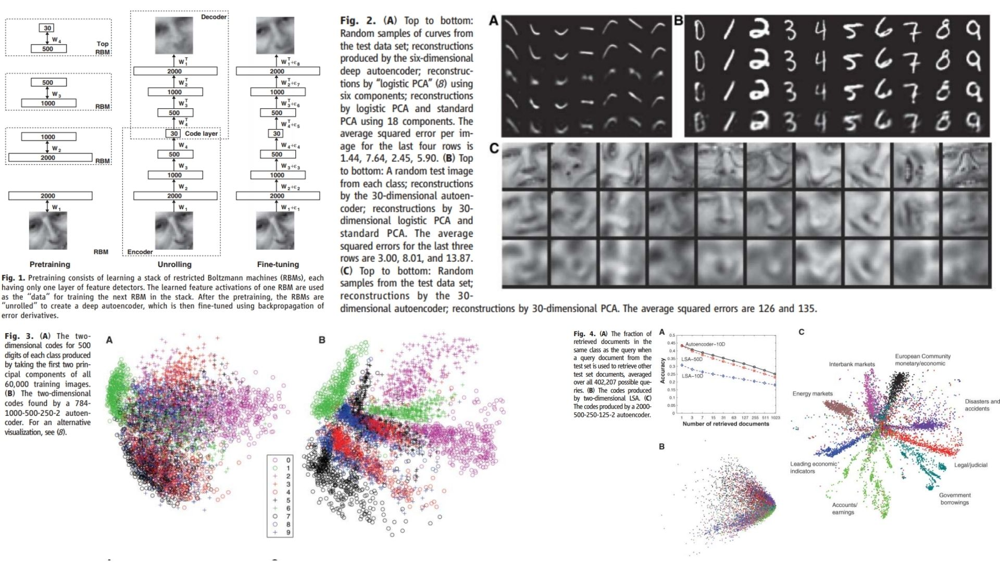

# 🧮 Deep Autoencoder RBM Replication

This repository contains a **minimal and faithful replication** of the **Deep Autoencoder with RBM pretraining** in PyTorch.  
The goal is to reproduce the core ideas of **layer-wise pretraining**, **deep encoding-decoding**, and **dimensionality reduction** in a clean, modular, and easy-to-extend form.  

- Deep autoencoder with **RBM pretraining** 🌀  
- Layer-wise encoding-decoding architecture 🌿  
- Captures hierarchical features from raw inputs 🧠  
- Suitable for dimensionality reduction, feature extraction, and unsupervised representation learning ✨
-  
**Paper reference:** [Hinton & Salakhutdinov, 2006 – Reducing the Dimensionality of Data with Neural Networks](https://www.cs.toronto.edu/~hinton/absps/science.pdf) 🧩

---

## 🌄 Overview – Deep Autoencoder Architecture



This overview highlights the structure:

- Input data (e.g., 784-dimensional vectors for MNIST) is **compressed through stacked RBM layers** 
- **Encoding Network** reduces dimensionality to the code layer  
- **Code Layer** represents the most compact feature representation 
- **Decoding Network** reconstructs the input from the code, aiming to minimize reconstruction error 
- Layer-wise pretraining with RBMs helps the network **initialize weights efficiently** before fine-tuning.  

---

## 📐 Key Mathematical Idea

The Deep Autoencoder is trained to **minimize reconstruction error**:

For input $$x$$, encoding function $$f$$, decoding function $$g$$:

$$
h = f(x) = \sigma(W_{enc} x + b_{enc})
$$

$$
\hat{x} = g(h) = \sigma(W_{dec} h + b_{dec})
$$

$$
\mathcal{L}_{recon} = \frac{1}{N} \sum_{i=1}^{N} ||x_i - \hat{x}_i||^2
$$

RBM pretraining uses **contrastive divergence**:

$$
\Delta W = \eta (\langle v h \rangle_{data} - \langle v h \rangle_{recon})
$$

$$
\Delta b_v = \eta \langle v - v_{recon} \rangle, \quad
\Delta b_h = \eta \langle h - h_{recon} \rangle
$$

where:

- $$v$$: visible units, $$h$$: hidden units  
- $$\langle \cdot \rangle$$ denotes expectation over data or model  
- $$\eta$$ is the learning rate  

Pretraining initializes the weights $$W$$ before fine-tuning the full autoencoder with **backpropagation**.  

---

## 📦 File Structure

```bash
DeepAutoencoder-RBM-Replication/
├── src/
│   ├── layers/
│   │   ├── rbm_layer.py
│   │   ├── encoder_layer.py
│   │   ├── decoder_layer.py
│   │   ├── code_layer.py
│   │   └── utils_layers.py
│   │
│   ├── modules/
│   │   ├── rbm_stack.py
│   │   ├── encoder_network.py
│   │   └── decoder_network.py
│   │
│   ├── model/
│   │   └── deep_autoencoder.py
│   │
│   └── config.py
│
├── images/
│   └── figmix.jpg
│
├── requirements.txt
└── README.md
```
---


## 🔗 Feedback

For questions or feedback, contact: [barkin.adiguzel@gmail.com](mailto:barkin.adiguzel@gmail.com)
